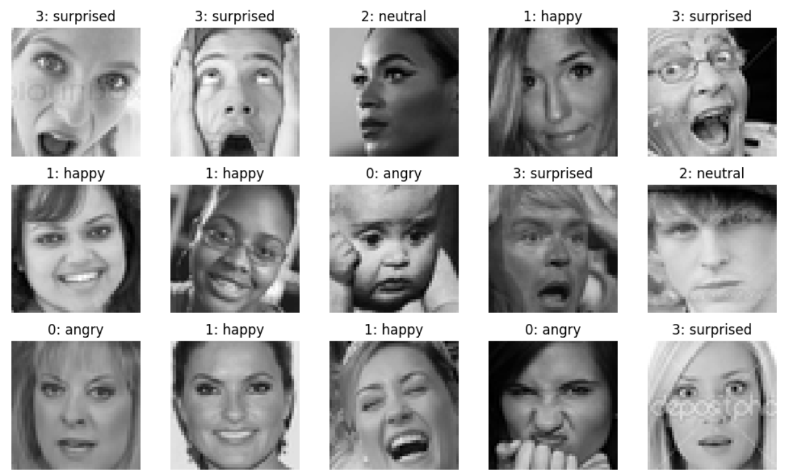

# Facial Emotion Recognition using Random Forest, SVM, and CNN  

## Project Overview  
This project focuses on recognizing facial emotions (Angry, Happy, Neutral, Surprised) using three machine learning models:  
- **Random Forest**
 
  link for the code: https://colab.research.google.com/drive/1MK6233t68IpmljrVmoBePAcc2wuICrXJ?usp=sharing

- **Support Vector Machine (SVM)**

  Link for the code: https://colab.research.google.com/drive/1vm3IX2QgQlndiUO5SQJPuELCzOlLrtZl?usp=sharing
  
- **Convolutional Neural Networks (CNN)**
  Link for the code: https://colab.research.google.com/drive/1uC5aVR2lOBBA2WHe6aMrI4OSKK4qAYd1?usp=sharing

The dataset consists of 48x48 RGB images and one-hot encoded labels. We perform comprehensive analysis and comparison of the three models, including their strengths, limitations, and generalization abilities.

---

## Dataset Analysis  

### Files:  
- **`images.npy`**: Contains **19,950 images** (48x48 pixels, RGB channels).  
- **`labels.npy`**: Contains **one-hot encoded labels** for the images.

### Class Distribution:  
| Emotion   | Count   |  
|-----------|---------|  
| Angry     | 3,850   |  
| Happy     | 7,200   |  
| Neutral   | 5,100   |  
| Surprised | 3,800   |  

### Dataset Split:  
- **Training**: 13,965 images (70%)  
- **Validation**: 4,009 images (20%)  
- **Testing**: 1,976 images (10%)  

---

## Results Summary  

| Model            | Validation Accuracy | Test Accuracy | Key Observations                                  |  
|------------------|---------------------|---------------|-------------------------------------------------|  
| Random Forest    | 0.56                | 0.56          | Moderate performance; struggles with "Angry".    |  
| SVM              | 0.43                | 0.42          | High bias toward "Happy"; struggles with recall. |  
| CNN              | **0.78**            | **0.76**      | Best overall performance; balanced across classes.|

---

## 1. Random Forest  

### Best Parameters:  
- **max_depth**: 20  
- **max_features**: "sqrt"  
- **n_estimators**: 200  

### Accuracy:  
- Validation Accuracy: **0.56**  
- Test Accuracy: **0.56**  

### Key Hyperparameters:  
- **max_depth**: Limits tree depth to prevent overfitting.  
- **max_features**: Introduces randomness by limiting features per split.  
- **n_estimators**: Increases prediction robustness by averaging multiple trees.  

---

## 2. Support Vector Machine (SVM)  

### Hyperparameters:  
- **C**: 10  
- **gamma**: 0.001  

### Accuracy:  
- Validation Accuracy: **0.43**  
- Test Accuracy: **0.42**  

### Observations:  
- SVM suffers from class imbalance and overfitting.  
- The "Happy" class dominates predictions due to higher support.  

### Strengths and Limitations:  
- **Strengths**: Handles non-linear relationships and smaller datasets effectively.  
- **Limitations**: Struggles with scalability, class imbalance, and computational expense.  

---

## 3. Convolutional Neural Network (CNN)  

### Model Architecture  

**Input Preprocessing**: Rescales pixel values to normalize input.  

#### 1st Block:  
- **Conv2D**: 48 filters, kernel size (3x3), activation "ReLU"  
- **MaxPooling2D**: Pool size (2x2)  
- **Dropout**: Rate 0.25  

#### 2nd Block:  
- **Conv2D**: 64 filters, kernel size (3x3), activation "ReLU"  
- **MaxPooling2D**: Pool size (2x2)  
- **Dropout**: Rate 0.25  

#### 3rd Block:  
- **Conv2D**: 64 filters, kernel size (3x3), activation "ReLU"  
- **MaxPooling2D**: Pool size (2x2)  

**Flatten Layer**: Converts output to 1D with 1024 units.  

#### Dense Layers:  
- **Dense**: 128 units, activation "ReLU"  
- **Dropout**: Rate 0.5  
- **Dense**: 4 units (Softmax for 4 classes)  

### Compilation:  
- **Optimizer**: Adam  
- **Loss Function**: Sparse Categorical Crossentropy  
- **Metrics**: Accuracy  

### Results:  
- **Best F1-scores**: "Happy" (0.78), "Surprised" (0.76)  
- **Lowest F1-score**: "Angry" (0.54)  

### Observations:  
- CNN exhibits **minimal overfitting** due to **early stopping** and dropout regularization.  
- Handles class imbalance better than Random Forest and SVM.  

---

## Early Stopping  
- **Purpose**: Stops training when validation performance plateaus, preventing overfitting.  
- **Epochs**: Divides training into passes over the entire dataset.  

---

## Loss Function  
- **Function**: Sparse Categorical Crossentropy  
- **Objective**: Minimize difference between predicted and true labels.  
- **Insights**:  
   - **Decreasing loss**: Model learning effectively.  
   - **Increasing loss**: Overfitting or insufficient learning.  

---

## Results Comparison  

| Metric                  | Random Forest | SVM     | CNN     |  
|-------------------------|---------------|---------|---------|  
| Validation Accuracy     | 0.56          | 0.43    | **0.78**|  
| Test Accuracy           | 0.56          | 0.42    | **0.76**|  
| Best Class Performance  | "Happy"       | "Happy" | "Happy" |  
| Worst Class Performance | "Angry"       | "Neutral"| "Angry" |  

### Key Takeaways:  
1. **CNN** outperforms both Random Forest and SVM, achieving the highest accuracy and balanced performance.  
2. **Random Forest** is computationally efficient but struggles with complex relationships.  
3. **SVM** shows severe limitations with class imbalance and scalability.  

---

## Metrics Used  

- **Precision**: Proportion of correct positive predictions.  
- **Recall (Sensitivity)**: Proportion of actual positives correctly predicted.  
- **F1-Score**: Harmonic mean of precision and recall.  
- **Support**: Number of actual instances per class.

---

## Generalization  
Generalization refers to the model's ability to perform well on unseen data. In this project:  
- **CNN** achieves the best generalization.  
- **Random Forest** and **SVM** overfit or bias heavily toward specific classes.

---

## Conclusion  

This project highlights the strengths and limitations of Random Forest, SVM, and CNN for facial emotion recognition:  
- **CNN** excels in feature extraction and classification accuracy.  
- **Random Forest** and **SVM** provide alternative approaches but require improvements for real-world applications.  

---

## Author  
**Wadoud Guelmami**  
*Machine Learning and AI Enthusiast*  

---

